# Diagrama de Base de Datos — NODO Catalog Manager (Fase 1 a Fase 7)

## Diagrama entidad-relación

```mermaid
erDiagram
    USERS ||--o{ PRODUCTS : "crea/edita"
    USERS ||--o{ IMPORT_BATCHES : "sube"
    USERS ||--o{ AI_GENERATIONS : "solicita"
    USERS ||--o{ IMAGE_GENERATIONS : "genera"
    USERS ||--o{ SOCIAL_POSTS : "crea"
    PRODUCTS ||--o{ AI_GENERATIONS : "referencia"
    PRODUCTS ||--o{ IMAGE_GENERATIONS : "referencia"
    PRODUCTS ||--o{ SOCIAL_POSTS : "referencia"
    IMAGE_TEMPLATES ||--o{ IMAGE_GENERATIONS : "usa"
    SOCIAL_ACCOUNTS ||--o{ SOCIAL_POSTS : "publica"
    COLLECTIONS ||--o{ CATEGORIES : "agrupa"
    COLLECTIONS ||--o{ PRODUCTS : "clasifica"
    CATEGORIES ||--o{ PRODUCTS : "clasifica"
    PRODUCTS ||--o{ PRODUCT_IMAGES : "galería"
    USERS }o--o{ ROLES : "model_has_roles"
    ROLES }o--o{ PERMISSIONS : "role_has_permissions"
    USERS }o--o{ PERMISSIONS : "model_has_permissions"
    CONTACTS }o--o{ CONTACT_LISTS : "contact_list_contact"
    CONTACT_LISTS ||--o{ EMAIL_CAMPAIGNS : "destinataria de"
    USERS ||--o{ EMAIL_CAMPAIGNS : "crea"
    EMAIL_CAMPAIGNS ||--o{ EMAIL_CAMPAIGN_SENDS : "genera"
    CONTACTS ||--o{ EMAIL_CAMPAIGN_SENDS : "recibe"
    PRODUCTS ||--o{ LANDING_PAGES : "destaca en"
    USERS ||--o{ LANDING_PAGES : "crea"
    CONTACT_LISTS ||--o{ LANDING_PAGES : "recibe prospectos de"
    LANDING_PAGES ||--o{ LANDING_LEADS : "genera"
    CONTACTS ||--o{ LANDING_LEADS : "origina"
    CONTACTS ||--o{ CRM_DEALS : "es prospecto en"
    PRODUCTS ||--o{ CRM_DEALS : "referencia"
    CRM_STAGES ||--o{ CRM_DEALS : "clasifica"
    USERS ||--o{ CRM_DEALS : "asignado a"
    LANDING_LEADS ||--o| CRM_DEALS : "convertido en"
    CRM_DEALS ||--o{ CRM_ACTIVITIES : "registra"
    USERS ||--o{ CRM_ACTIVITIES : "crea"

    USERS {
        bigint id PK
        string name
        string email UK
        string phone
        boolean is_active
        timestamp last_login_at
        string last_login_ip
        timestamp deleted_at
    }

    COLLECTIONS {
        bigint id PK
        string name
        string slug UK
        string icon
        string color
        int sort_order
        boolean is_active
        timestamp deleted_at
    }

    CATEGORIES {
        bigint id PK
        string name
        string slug UK
        bigint collection_id FK
        boolean is_active
        timestamp deleted_at
    }

    PRODUCTS {
        bigint id PK
        string sku UK
        string name
        string slug UK
        bigint category_id FK
        bigint collection_id FK
        enum type
        text short_description
        longtext description
        longtext benefits
        longtext features
        decimal price
        decimal old_price
        string currency
        string pricing_model
        boolean tax_included
        enum availability
        enum status
        string main_image
        json tags
        json structured_data
        timestamp published_at
        boolean is_featured
        bigint created_by FK
        bigint updated_by FK
        timestamp deleted_at
    }

    PRODUCT_IMAGES {
        bigint id PK
        bigint product_id FK
        string path
        string alt_text
        int sort_order
    }

    IMPORT_BATCHES {
        bigint id PK
        bigint user_id FK
        string type
        string original_filename
        string status
        int total_rows
        int processed_rows
        int success_rows
        int error_rows
        string duplicate_strategy
        json column_mapping
        json errors
    }

    SETTINGS {
        bigint id PK
        string group
        string key UK
        longtext value
        boolean is_encrypted
    }

    AI_GENERATIONS {
        bigint id PK
        bigint user_id FK
        bigint product_id FK
        string task
        string provider
        string model
        longtext prompt
        longtext response
        int input_tokens
        int output_tokens
        decimal estimated_cost
        string status
    }

    IMAGE_TEMPLATES {
        bigint id PK
        string name
        string slug UK
        string format
        int width
        int height
        string background_type
        string background_value
        boolean overlay_gradient
        string primary_color
        string accent_color
        string title_position
        boolean show_price
        boolean show_qr
        string footer_text
        boolean is_master
    }

    IMAGE_GENERATIONS {
        bigint id PK
        bigint user_id FK
        bigint template_id FK
        bigint product_id FK
        string title
        string subtitle
        string cta_text
        string price_text
        string qr_target_url
        string background_source
        string file_path
        text ai_prompt
        string status
    }

    SOCIAL_ACCOUNTS {
        bigint id PK
        string channel
        string label
        string external_account_id
        text access_token
        timestamp token_expires_at
        boolean is_active
    }

    SOCIAL_POSTS {
        bigint id PK
        bigint user_id FK
        bigint product_id FK
        bigint social_account_id FK
        string channel
        text content
        string image_path
        string hashtags
        string link
        timestamp scheduled_at
        string timezone
        string status
        string external_post_id
        text error_message
        bigint duplicated_from FK
    }

    ROLES {
        bigint id PK
        string name UK
        string guard_name
    }

    PERMISSIONS {
        bigint id PK
        string name UK
        string guard_name
    }

    ACTIVITY_LOG {
        bigint id PK
        string log_name
        text description
        string subject_type
        bigint subject_id
        string causer_type
        bigint causer_id
        json properties
    }

    CONTACTS {
        bigint id PK
        string name
        string company
        string phone
        string whatsapp
        string email UK
        string source
        json tags
        boolean consent
        timestamp consent_at
        boolean subscribed
        timestamp unsubscribed_at
        text notes
        timestamp deleted_at
    }

    CONTACT_LISTS {
        bigint id PK
        string name
        string slug UK
        string description
    }

    EMAIL_CAMPAIGNS {
        bigint id PK
        string name
        string type
        string subject
        string from_name
        string from_email
        bigint contact_list_id FK
        json blocks
        string status
        timestamp scheduled_at
        timestamp sent_at
        int sent_count
        int open_count
        int click_count
        int bounce_count
        int unsubscribe_count
        int batch_limit
        bigint created_by FK
        timestamp deleted_at
    }

    EMAIL_CAMPAIGN_SENDS {
        bigint id PK
        bigint email_campaign_id FK
        bigint contact_id FK
        string token UK
        string status
        timestamp sent_at
        timestamp opened_at
        timestamp clicked_at
        text error_message
    }

    LANDING_PAGES {
        bigint id PK
        string name
        string slug UK
        bigint product_id FK
        string status
        string headline
        string subheadline
        string hero_image_path
        json sections
        string cta_text
        string cta_whatsapp_number
        string cta_whatsapp_message
        string cta_url
        string meta_title
        string meta_description
        string og_image_path
        json structured_data
        string ga4_id
        string meta_pixel_id
        string gtm_id
        boolean capture_form_enabled
        bigint contact_list_id FK
        int views_count
        int leads_count
        timestamp published_at
        bigint created_by FK
        timestamp deleted_at
    }

    LANDING_LEADS {
        bigint id PK
        bigint landing_page_id FK
        bigint contact_id FK
        string name
        string email
        string phone
        text message
        string utm_source
        string utm_medium
        string utm_campaign
        string ip_address
    }

    CRM_STAGES {
        bigint id PK
        string name
        string slug UK
        string color
        int sort_order
        boolean is_won
        boolean is_lost
    }

    CRM_DEALS {
        bigint id PK
        string title
        bigint contact_id FK
        bigint product_id FK
        bigint stage_id FK
        decimal value
        string currency
        string source
        string status
        date expected_close_date
        string lost_reason
        bigint assigned_to FK
        bigint created_by FK
        bigint landing_lead_id FK
        timestamp deleted_at
    }

    CRM_ACTIVITIES {
        bigint id PK
        bigint deal_id FK
        bigint user_id FK
        string type
        text content
        timestamp due_at
        timestamp completed_at
    }
```

## Descripción de tablas

| Tabla | Propósito |
|---|---|
| `users` | Usuarios del sistema. Extiende la tabla estándar de Laravel con teléfono, avatar, estado activo/inactivo, último acceso y eliminación lógica. |
| `roles` / `permissions` / `model_has_roles` / `model_has_permissions` / `role_has_permissions` | Sistema de roles y permisos (paquete spatie/laravel-permission). |
| `collections` | Las 6 grandes líneas de negocio de NODO 360 (Inteligencia Artificial, Automatización Empresarial, Software Empresarial, Growth Marketing, Soluciones por Industria, Transformación Digital) y cualquier colección adicional que se cree. |
| `categories` | Subdivisión opcional dentro de una colección. |
| `products` | Catálogo de productos y servicios, con todos los campos comerciales, de precio, SEO y publicación descritos en el brief. |
| `product_images` | Galería de imágenes adicionales por producto (la imagen principal se guarda directamente en `products.main_image`). |
| `import_batches` | Historial y progreso de cada importación masiva, incluyendo el mapeo de columnas usado y el detalle de errores por fila. |
| `settings` | Configuración clave-valor del sistema (empresa, marca, regional, seguridad, IA), con soporte para valores cifrados. |
| `activity_log` | Auditoría de acciones del sistema (paquete spatie/laravel-activitylog). |
| `ai_generations` | Registro de cada solicitud de generación de contenido con IA: usuario, producto (opcional), tarea, proveedor, modelo, prompt, respuesta, tokens, costo aproximado y estado (completado/aprobado/rechazado/error). |
| `image_templates` | Plantillas de imagen reutilizables: formato, colores, posición del título, si muestra precio/QR, pie de marca. Incluye la plantilla maestra de NODO 360. |
| `image_generations` | Cada imagen compuesta: plantilla usada, producto (opcional), textos, origen del fondo, ruta del archivo generado y estado. |
| `social_accounts` | Cuentas conectadas de redes sociales por canal, con token de acceso cifrado y su vigencia. |
| `social_posts` | Publicaciones de redes sociales: canal, cuenta, producto (opcional), contenido, imagen, programación y estado (borrador/programada/enviada/pendiente de autorización/error/publicada manual/cancelada). |
| `contacts` | Contactos de email marketing: datos, origen, etiquetas, consentimiento (con fecha) y estado de suscripción, con eliminación lógica. |
| `contact_lists` | Listas para segmentar contactos al enviar campañas. |
| `contact_list_contact` | Tabla pivote entre `contacts` y `contact_lists` (relación muchos a muchos). |
| `email_campaigns` | Campañas de email marketing: tipo, asunto, remitente, lista destinataria, contenido por bloques (JSON), estado, programación, límite de lote y métricas acumuladas (enviados/aperturas/clics/rebotes/bajas). |
| `email_campaign_sends` | Un registro por cada envío individual de una campaña a un contacto: token único (usado en el seguimiento y la baja), estado, marcas de tiempo de envío/apertura/clic y mensaje de error. |
| `landing_pages` | Landing pages: producto vinculado (opcional), estado, contenido del hero, secciones por bloques (JSON), llamada a la acción, SEO/Open Graph/datos estructurados, IDs de analítica (GA4/Meta Pixel/GTM), configuración de captura de prospectos, y métricas acumuladas (vistas/prospectos). |
| `landing_leads` | Prospectos capturados en el formulario de una landing page: datos de contacto, mensaje, atribución UTM, IP, y el contacto de email marketing que se creó a partir de él (si la landing tiene una lista configurada). |
| `crm_stages` | Etapas configurables del pipeline de ventas (columnas del tablero Kanban), con color, orden y marcado de "ganada"/"perdida". |
| `crm_deals` | Oportunidades del CRM: contacto, producto (opcional), etapa actual, valor estimado, origen (manual/landing/importación), estado, responsable asignado y el prospecto de landing page del que se originó (si aplica). |
| `crm_activities` | Notas, llamadas, reuniones, tareas/recordatorios (con fecha límite y marca de completado) y registros de WhatsApp asociados a una oportunidad del CRM. |
| `sessions`, `cache`, `cache_locks`, `jobs`, `failed_jobs`, `job_batches`, `password_reset_tokens` | Tablas de soporte de Laravel (colas, caché de base de datos si se habilita, recuperación de contraseña). |

## Relaciones clave

- Un **producto** pertenece opcionalmente a una **colección** y a una **categoría** (ambas nulificables si se elimina la colección/categoría, para no perder productos).
- Una **categoría** pertenece opcionalmente a una **colección**.
- Un **producto** tiene muchas **imágenes de galería**.
- Un **producto** registra qué **usuario** lo creó y quién lo editó por última vez.
- Un **lote de importación** pertenece al **usuario** que lo subió.
- Un **usuario** puede tener uno o varios **roles**, y cada **rol** agrupa uno o varios **permisos**.
- Un **contacto** puede pertenecer a varias **listas**, y una **lista** puede tener varios **contactos** (muchos a muchos).
- Una **campaña de email** pertenece opcionalmente a una **lista de contactos** (su destinataria) y genera muchos **envíos**, uno por cada **contacto** elegible (suscrito y con consentimiento) de la lista.
- Una **landing page** pertenece opcionalmente a un **producto** (para la sección "producto destacado") y a una **lista de contactos** (destino de los prospectos capturados), y genera muchos **prospectos**; cada prospecto puede originar opcionalmente un **contacto** de email marketing.
- Una **oportunidad del CRM** pertenece a un **contacto** y a una **etapa**, y opcionalmente a un **producto**, a un **usuario asignado** y a un **prospecto de landing page** del que se originó; cada oportunidad tiene muchas **actividades**.

## Generar el diagrama visual

Este archivo usa sintaxis [Mermaid](https://mermaid.js.org/), compatible de forma nativa con la vista de archivos Markdown de GitHub/GitLab. También puedes pegar el bloque `erDiagram` en https://mermaid.live para exportarlo como imagen PNG/SVG.
